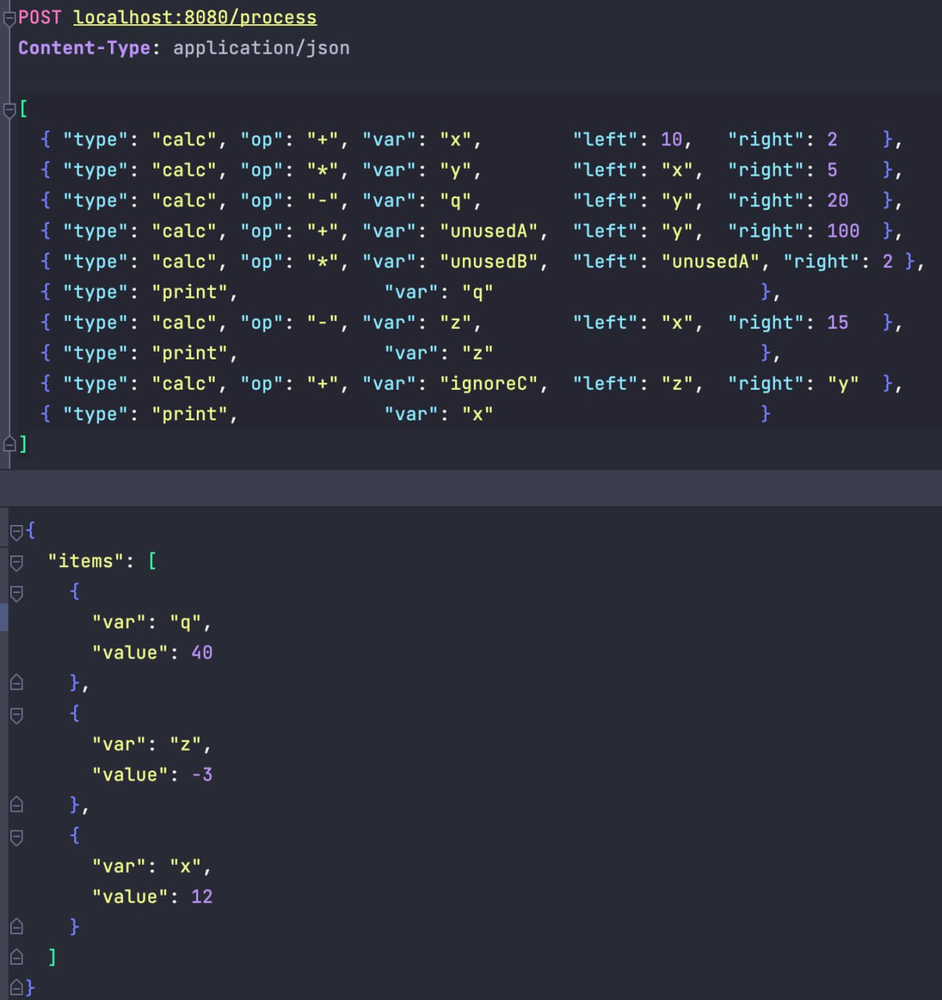
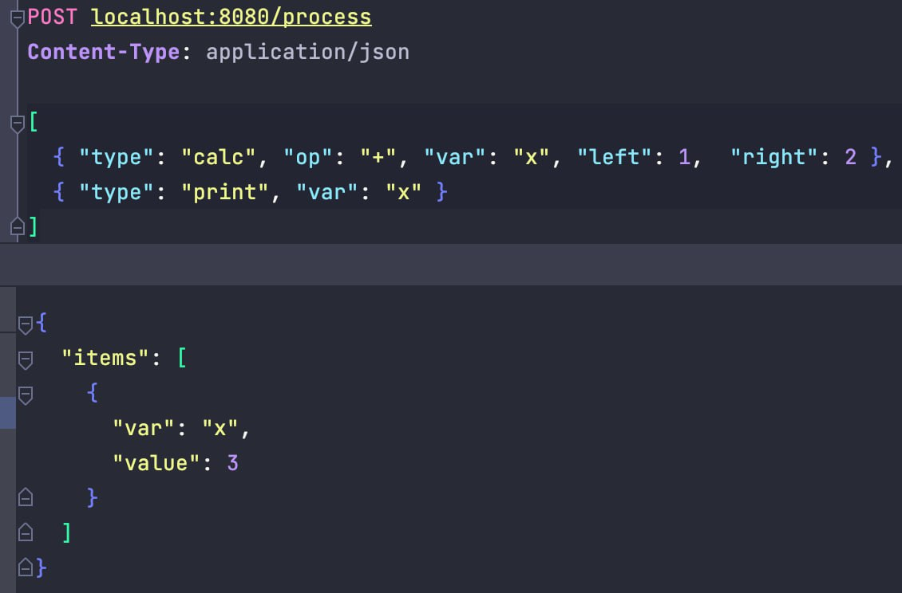
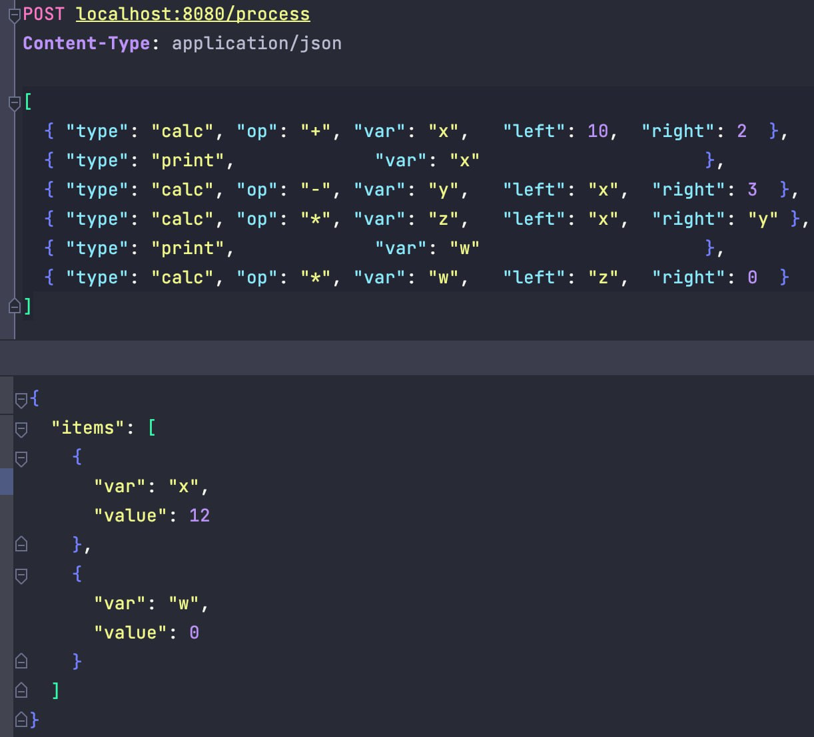

# Промышленный калькулятор

## Описание
Сервис, способный обработать 2 операции:
1. Вычислить значение переменной путем сложений литералов и/или переменных;
2. Распечатать значение переменной.


#### Принцип работы алгоритма
1. Первым шагом собираются все переменные, которые участвую в расчете, т.е. те, что были переданы на печать и все нижестоящие.
2. После сбора всех необходимых переменных, каждая из них отправляется на параллельный (*конкурентный для ценителей) расчет. Если зависимости еще не рассчитаны, то расчет блокируется до момента вычисления всех зависимостей.
3. После завершения самой долгой операции ручка сервиса возвращает ответ с перечисления всех значений, переданных для распечатки на вход.


### Технические особенности
1. Для сбора всех необходимых переменных был реализован рекурсивный dfs.
2. Блокировки происходят без mutex'ов, только лишь на done-каналах.


## Развертывание

```
docker-compose up -d
```

Команда поднимает сервисы:
- REST на 8080 порту;
- GRPS на 50051.

## Документация

OpenAPI документация лежит в директории /api.

Скриншоты запросов:


______

______
